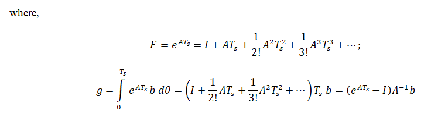

## Introduction

<b>Discipline | <b>Electrical Engineering 
:--|:--|
<b> Lab | <b> Digital Control Laboratory
<b> Experiment|     <b> Determine the Pulse Transfer Function and State Space Model of the DC Motor and Exp 5

### About the Experiment 

DC motors are widely used in position control applications, such as robotics, automation systems, and actuators, due to their simplicity, efficiency, and ability to provide precise control over speed and position.
To design effective position control systems for DC motor, it is essential to model their dynamic behavior accurately.   

<b><i>Pulse Transfer Function:</i></b>  
The transfer function is a mathematical representation of a system's input-output relationship in the continuous time domain. It is typically derived by taking the Laplace transform of the system's differential equations, assuming zero intial conditions. 
The general form of the transfer function is:

$$ G(s)= \frac{Y(s)}{U(s)} \tag{1} $$

where, Y(s) is the Laplace transform of the output, U(s) is the Laplace transform of the input.
 
The pulse transfer function describes the system's behavior in the discrete time domain. It is useful when working with sampled data systems. The pulse transfer function relates the input and output of a systems in the z-domain, which is the discrete time equivalent of the Laplace domain.  
The general form of the pulse transfer function is:

$$ G(z)= \frac{Y(z)}{U(z)} \tag{2} $$

where, Y(z) is the z transform of the output, U(z) is the z transform of the input.  
 

<b><i> State Space Model:</i></b>  
Linear time invariant system may be represented in state space form by the following equations:
 
State equation:

$$ \dot{x}(t)=A x(t)+B u(t) \tag{3a} $$

Output equation:

$$ y(t)= C x(t) \tag{3b} $$
 
where, x(t) is state vector, y(t) is output vector, 
u is input or control vector, A is system matrix, 
B is input matrix, C is output matrix.  

Discrete state space form represented by the following equations:  
State equation:

$$ {x}[k+1]=F x[k]+g u[k] \tag{4a} $$

Output equation:

$$ y[k] = C x[k] \tag{4b} $$

 

x[k] is state vector, y[k] is output vector, 
u is input or control vector, F is system matrix, 
g is input matrix, C is output matrix.   

<b>Subject matter expertise | <b> **Prof. Alok Kanti Deb**
:--|:--|
<b> Institute | <b>  **Indian Institute of Technology Kharagpur**
<b> Email id|     <b>  **alokkanti@ee.iitkgp.ac.in**
<b> Department |  **Department of Electrical Engineering**
<b>Webpage| <b> http://www.iitkgp.ac.in/department/EE/faculty/ee-alokkanti

### Contributors List

SrNo | Name | VLabs Developer or Integration Engineer | Designation | Department| Institute
:--|:--|:--|:--|:--|:--|
1 | **Kamal Sandeep Karreddula** | Developer | Research Scholar | Department of Electrical Engineering | IIT Kharagpur | 
2 | **Piyali Chattopadhyay** | Integration Engineer | Project Scientist | Department of Mechanical Engineering | IIT Kharagpur |

