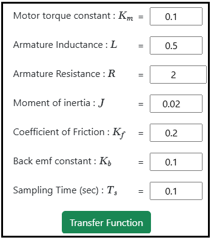
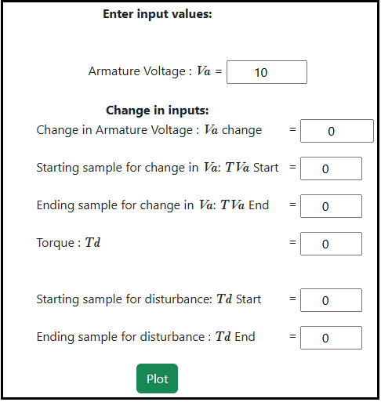
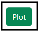

### Procedure

<b>Steps to perform the simulation</b>
		
1.  Enter the values of the DC motor parameter.

<b>Fig. 1. Parameter values of the DC motor</b>						  

2. Click on 'Transfer Function' button to get the transfer function form of the system.

           
    
<b>Fig. 2. Button to get the transfer function form of the system</b>							  

3. Click on 'Pulse Transfer Function' button to get the pulse transfer function form of the system.

<b>Fig. 3. Button to get the pulse transfer function form of the system</b>							  

4. Click on 'State Space Model' button to get the state space form of the system.

<b>Fig. 4. Button to get the state Space form of the system</b>							  

                    
5. Click on 'Discrete State Space Model' button to get the discrete state space form of the system.

<b>Fig. 5. Button to get the discrete state Space form of the system</b>							  

6. Click on ' Input values' button to enter the different input values to the system. 

<b>Fig. 6. Button to enter the desired input values </b>						  

7. Enter the desired input values. 

<b>Fig. 7. The desired input values </b>						  

8. Click on the 'Plot' button to get the response. 

<b>Fig. 8. Plot button to get the response </b>						  

9. Click on 'Download Plot' button to download the plot. 

10. Click on 'Clear' button to enter the new parameter values of the system.

